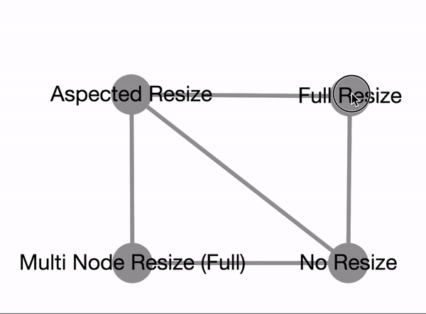

cytoscape-node-resize
================================================================================


## Description
A Cytoscape.js extension to provide grapples to resize nodes and a visual cue to resize node to its label, distributed under [The MIT License](https://opensource.org/licenses/MIT).



Please cite the following paper when using this extension:

U. Dogrusoz , A. Karacelik, I. Safarli, H. Balci, L. Dervishi, and M.C. Siper, "[Efficient methods and readily customizable libraries for managing complexity of large networks](https://doi.org/10.1371/journal.pone.0197238)", PLoS ONE, 13(5): e0197238, 2018.

## Demo

Click [here](https://raw.githack.com/iVis-at-Bilkent/cytoscape.js-node-resize/master/demo.html) (simple) or [here](https://raw.githack.com/iVis-at-Bilkent/cytoscape.js-node-resize/master/undoable_demo.html) (undoable) for demos

## Default Options

```js
            cy.nodeResize({
                padding: 5, // spacing between node and grapples/rectangle
                undoable: true, // and if cy.undoRedo exists
    
                grappleSize: 8, // size of square dots
                grappleColor: "green", // color of grapples
                inactiveGrappleStroke: "inside 1px blue",               
                boundingRectangleLineDash: [4, 8], // line dash of bounding rectangle
                boundingRectangleLineColor: "red",
                boundingRectangleLineWidth: 1.5,
                zIndex: 999,
    
                minWidth: function (node) {
                    var data = node.data("resizeMinWidth");
                    return data ? data : 15;
                }, // a function returns min width of node
                minHeight: function (node) {
                    var data = node.data("resizeMinHeight");
                    return data ? data : 15;
                }, // a function returns min height of node

                // Getters for some style properties the defaults returns ele.css('property-name')
                // you are encouraged to override these getters
                getCompoundMinWidth: function(node) { 
                  return node.css('min-width'); 
                },
                getCompoundMinHeight: function(node) { 
                  return node.css('min-height'); 
                },
                getCompoundMinWidthBiasRight: function(node) {
                  return node.css('min-width-bias-right');
                },
                getCompoundMinWidthBiasLeft: function(node) { 
                  return node.css('min-width-bias-left');
                },
                getCompoundMinHeightBiasTop: function(node) {
                  return node.css('min-height-bias-top');
                },
                getCompoundMinHeightBiasBottom: function(node) { 
                  return node.css('min-height-bias-bottom');
                },

                // These optional functions will be executed to set the width/height of a node in this extension
                // Using node.css() is not a recommended way (http://js.cytoscape.org/#eles.style) to do this. Therefore,
                // overriding these defaults so that a data field or something like that will be used to set node dimentions
                // instead of directly calling node.css() is highly recommended (Of course this will require a proper 
                // setting in the stylesheet).
                setWidth: function(node, width) { 
                    node.css('width', width);
                },
                setHeight: function(node, height) {
                    node.css('height', height);
                },
    
                isFixedAspectRatioResizeMode: function (node) { return node.is(".fixedAspectRatioResizeMode") },// with only 4 active grapples (at corners)
                isNoResizeMode: function (node) { return node.is(".noResizeMode, :parent") }, // no active grapples
                isNoControlsMode: function (node) { return node.is(".noControlsMode") }, // no controls - do not draw grapples
    
                cursors: { // See http://www.w3schools.com/cssref/tryit.asp?filename=trycss_cursor
                    // May take any "cursor" css property
                    default: "default", // to be set after resizing finished or mouseleave
                    inactive: "not-allowed",
                    nw: "nw-resize",
                    n: "n-resize",
                    ne: "ne-resize",
                    e: "e-resize",
                    se: "se-resize",
                    s: "s-resize",
                    sw: "sw-resize",
                    w: "w-resize"
                }

                // enable resize content cue according to the node
                resizeToContentCueEnabled: function (node) {
                  return true;
                },
                // handle resize to content with given function
                // default function resizes node according to the label
                resizeToContentFunction: undefined,
                // select position of the resize to content cue
                // options: 'top-left', 'top-right', 'bottom-left', 'bottom-right'
                resizeToContentCuePosition: 'bottom-right',
                // relative path of the resize to content cue image
                resizeToContentCueImage: '/node_modules/cytoscape-node-resize/resizeCue.svg',
             });
```

## API

  `var api = cy.nodeResize('get')`
   To get the extension instance after initialization.

  `api.refreshGrapples()`
   Refresh rendered node grapples if any. It is an expensive operation and is supposed to be called in rare cases (When it is really needed).

  `api.removeGrapples()`
   Remove grapples while node is selected. This is useful when a node is selected but no need to show grapples. 


## Dependencies

 * Cytoscape.js ^3.2.0
 * jquery ^1.7.0 || ^2.0.0 || ^3.0.0
 * konva ^1.6.3
 * cytoscape-undo-redo ^1.0.10 (optional)


## Usage instructions

Download the library:
 * via npm: `npm install cytoscape-node-resize`,
 * via bower: `bower install cytoscape-node-resize`, or
 * via direct download in the repository (probably from a tag).

`require()` the library as appropriate for your project:

CommonJS:
```js
var cytoscape = require('cytoscape');
var nodeResize = require('cytoscape-node-resize');
var konva = require('konva');

nodeResize( cytoscape, jQuery, konva ); // register extension
```

AMD:
```js
require(['cytoscape', 'cytoscape-node-resize', 'jquery', 'konva'], function( cytoscape, nodeResize, jQuery, konva ){
  nodeResize( cytoscape, jQuery, konva ); // register extension
});
```

Plain HTML/JS has the extension registered for you automatically, because no `require()` is needed.


## Emitted Events
`cy.on("noderesize.resizestart", function(e, type, node){ })`

`cy.on("noderesize.resizeend", function(e, type, node){ })`

`cy.on("noderesize.resizedrag", function(e, type, node){ })`

`cy.on("noderesize.resizetocontent", function(e, node){ })`

`type` param can be `topleft`, `topcenter`, `topright`, `centerright`, 
`bottomright`, `bottomcenter`, `bottomleft`, `centerleft`

`node` param corresponds to currently resizing node.

## Publishing instructions

This project is set up to automatically be published to npm and bower.  To publish:

1. Set the version number environment variable: `export VERSION=1.2.3`
1. Publish: `gulp publish`
1. If publishing to bower for the first time, you'll need to run `bower register cytoscape-node-resize https://github.com/iVis-at-Bilkent/cytoscape.js-node-resize.git`

## Team

  * [Metin Can Siper](https://github.com/metincansiper), [Ahmet Candiroglu](https://github.com/ahmetcandiroglu), [Selim Firat Yilmaz](https://github.com/mrsfy), and [Ugur Dogrusoz](https://github.com/ugurdogrusoz) of [i-Vis at Bilkent University](http://www.cs.bilkent.edu.tr/~ivis)
