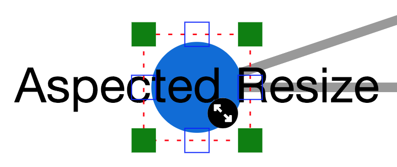

cytoscape-node-resize
================================================================================


## Description
Provides grapples to resize nodes.




## API

Only consists of initilization & default options.

```js
            cy.nodeResize({
                padding: 5, // spacing between node and grapples/rectangle
                undoable: true, // and if cy.undoRedo exists
    
                grappleSize: 8, // size of square dots
                grappleColor: "green", // color of grapples
                inactiveGrappleStroke: "inside 1px blue",
                boundingRectangle: true, // enable/disable bounding rectangle
                boundingRectangleLineDash: [4, 8], // line dash of bounding rectangle
                boundingRectangleLineColor: "red",
                boundingRectangleLineWidth: 1.5,
                zIndex: 999,
    
                minWidth: function (node) {
                    var data = node.data("resizeMinWidth");
                    return data ? data : 15;
                }, // a function returns min width of node
                minHeight: function (node) {
                    var data = node.data("resizeMinHeight");
                    return data ? data : 15;
                }, // a function returns min height of node
    
                isFixedAspectRatioResizeMode: function (node) { return node.is(".fixedAspectRatioResizeMode") },// with only 4 active grapples (at corners)
                isNoResizeMode: function (node) { return node.is(".noResizeMode, :parent") }, // no active grapples
    
                cursors: { // See http://www.w3schools.com/cssref/tryit.asp?filename=trycss_cursor
                    // May take any "cursor" css property
                    default: "default", // to be set after resizing finished or mouseleave
                    inactive: "not-allowed",
                    nw: "nw-resize",
                    n: "n-resize",
                    ne: "ne-resize",
                    e: "e-resize",
                    se: "se-resize",
                    s: "s-resize",
                    sw: "sw-resize",
                    w: "w-resize"
                }
             });
```


## Dependencies

 * Cytoscape.js ^2.7.0
 * oCanvas ^2.8.0
 * cytoscape-undo-redo ^1.0.10 (optional)


## Usage instructions

Download the library:
 * via npm: `npm install cytoscape-node-resize`,
 * via bower: `bower install cytoscape-node-resize`, or
 * via direct download in the repository (probably from a tag).

`require()` the library as appropriate for your project:

CommonJS:
```js
var cytoscape = require('cytoscape');
var nodeResize = require('cytoscape-node-resize');
var oCanvas = require('oCanvas');

nodeResize( cytoscape, jQuery, oCanvas ); // register extension
```

AMD:
```js
require(['cytoscape', 'cytoscape-node-resize', "jquery", "oCanvas"], function( cytoscape, nodeResize, jQuery, oCanvas ){
  nodeResize( cytoscape, jQuery, oCanvas ); // register extension
});
```

Plain HTML/JS has the extension registered for you automatically, because no `require()` is needed.


## Emitted Events
`cy.on("resizestart", function(e, type, nodes){ })`

`cy.on("resizeend", function(e, type, nodes){ })`


`type` param can be `topleft`, `topcenter`, `topright`, `centerright`, 
`bottomright`, `bottomcenter`, `bottomleft`, `centerleft`

`nodes` param corresponds to currently resizing nodes.

## Publishing instructions

This project is set up to automatically be published to npm and bower.  To publish:

1. Set the version number environment variable: `export VERSION=1.2.3`
1. Publish: `gulp publish`
1. If publishing to bower for the first time, you'll need to run `bower register cytoscape-node-resize https://github.com/iVis-at-Bilkent/cytoscape.js-node-resize.git`

## Team

  * [Selim Firat Yilmaz](https://github.com/mrsfy), [Ugur Dogrusoz](https://github.com/ugurdogrusoz) of [i-Vis at Bilkent University](http://www.cs.bilkent.edu.tr/~ivis)
